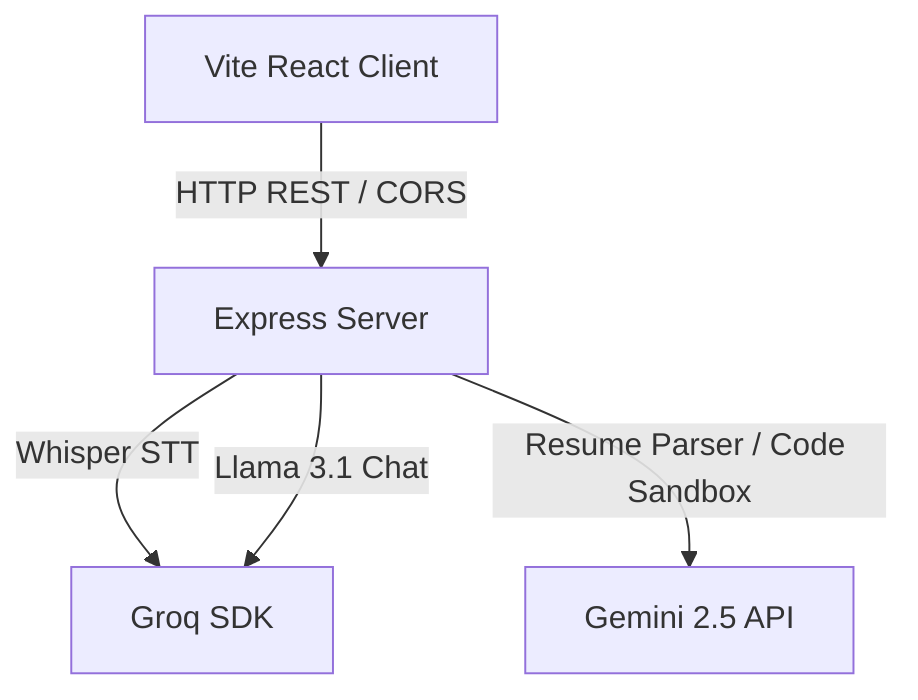

# Smith AI Interview Platform 🤖💼

An enterprise-ready, premium AI-powered simulator designed to run mock technical, behavioral, and coding interviews. Built with **React** on the frontend, **Express** on the backend, and powered by state-of-the-art Generative AI models from **Google Gemini** and **Groq**.

---

## 🌟 Core Features

### 1. Resume Intelligence (ATS Auditor)
- Parse resumes (PDF/DOCX) using **Gemini 2.5 Flash** to extract education, certifications, projects, and work experience.
- Computes real-time **ATS Match Scores** and generates targeted AI lists for strengths, weaknesses, and missing core skills.

### 2. Interactive Mock Rounds (Voice & Text)
- Experience conversational behavioral and technical interviews simulated by **Smith AI**.
- Features highly accurate voice transcriptions powered by **Groq Whisper** and conversational reasoning with **Llama 3.1**.

### 3. Integrated Code Sandbox (Practice & Test)
- Embedded Monaco Editor sandbox supporting **Python, JavaScript, C, C++, and Java**.
- Real-time sandbox execution engine coupled with **Gemini Code Evaluation** for structure, time complexity, and optimization reviews.

### 4. Enterprise Performance Analytics
- Rich performance dashboards with custom SVG visualization donuts indicating:
  - **Technical Accuracy**
  - **Logical Thinking**
  - **Communication Confidence**
- Dynamic trend tracking logs mapping overall score performance over consecutive interview attempts.

---

## ⚙️ Architecture & Tech Stack



- **Frontend:** React, Vite, Monaco Editor, Vanilla CSS custom variables.
- **Backend:** Node.js, Express, Multer (Memory Storage), PDF-Parse, Mammoth.
- **AI Integrations:** Google Generative AI, Groq SDK.
- **Tests:** Jest (100+ cases unit/integration test coverage), Playwright.

---

## 🚀 Setup & Installation

### 1. Clone the repository
```bash
git clone https://github.com/chakrichitteti24-afk/smith-Ai.git
cd smith-Ai
```

### 2. Install all dependencies
```bash
npm run install:all
```

### 3. Configure environment variables
Create a `.env` file in the root directory:
```env
PORT=3001
GROQ_API_KEY=your_groq_api_key
GROQ_WHISPER_API_KEY=your_groq_api_key
GEMINI_API_KEY=your_gemini_api_key
CLIENT_ORIGINS=http://localhost:5173
```

### 4. Start Development Server
```bash
npm run dev:clean
```
This script frees port 3001 and concurrently runs both the React client and Express server.

---

## 🧪 Testing Suite

### Run API Unit & Integration Tests (100+ assertions)
```bash
npm run test:api
```

### Run Playwright E2E Tests
```bash
npm run test:e2e
```

---

## ☁️ Deployment

- **Frontend Deployments:** Optimally deployed on **Vercel** with SPA fallback rewrites configured in `client/vercel.json`.
- **Backend Deployments:** Configured for one-click **Render** hosting via the included `render.yaml` Blueprint file.
